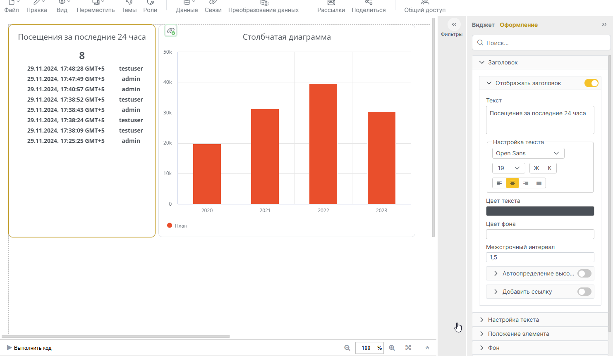
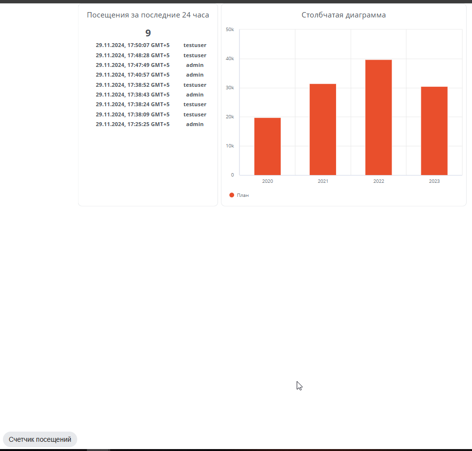
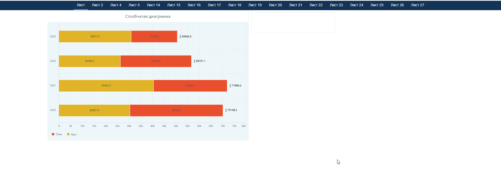

# Примеры кастомных виджетов Visiology 3

### Счетчик посещений на основе стандартного виджета "Текст"

Код : counter.js

Виджет основан на запросах к API встроенной системе мониторинга Grafana

Предварительные настройки:
1. Создать токен авторизации Графаны  
Зайти в интерфейс Графаны адрес_платформы/v3/grafana
В разделе Administration - Service Accounts создать сервисную учетку с ролью Viewer, создать в ней токен авторизации API.
2. В установке Visiology3 по умолчанию ID источника данных Loki скорее всего будет равен 3, но на всяякий случай лучше убедиться, выполнив запрос на эндпоинт адрес_платформы//v3/grafana/api/datasources

Использование:  
На дашборде создать стандартный виджет "Текст".
Включить в основных настройках возможность редактирования кода виджета.
Заменить код виджета кодом из прилагаемого файла.

### Автоматическое переключение листов дашборда с заданным интервалом

Код : sheet_rotation.js

Использование:  
Код необходимо вставить в один из виджетов на каждом листе дашборда.
Можно в существующий, либо создать пустой виджет за границей видимости, чтобы отделить функционал от остального.
При публикации дашборда панель навигации не должна быть скрыта, так как переключение завязано на ее элементы.

### Групповой переключатель виджетов

Код: group_switcher.js  
[Пример](https://example.visiology.su/v3/dashboard-viewer?workspaceId=c486179e-193f-4099-9544-7109bb900914&dashboardGuid=fea24aacfb7e4a2d96b3166cb7c428a3&showNav=true)

Использование:
На дашборде создать стандартный виджет "Текст".
Включить в основных настройках возможность редактирования кода виджета.
Заменить код виджета кодом из прилагаемого файла.
В коде в объекте selectOptions настроить свои идентификаторы и названия групп и виджетов.

### Стилизация навигационной панели дашборда под вторую версию платформы

Код: v2navpanel.js

Использование:
Поместить файл в папку **customjs** на сервере платформы.
